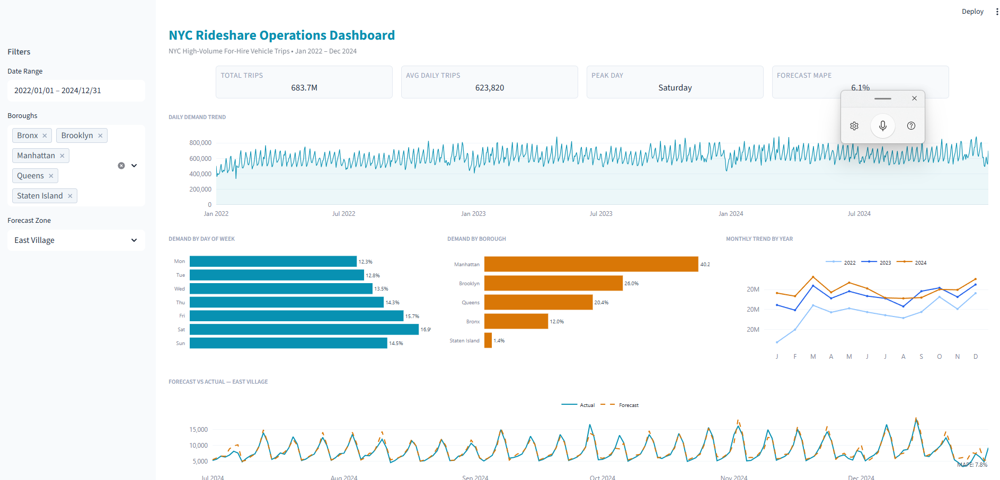

# NYC Rideshare Demand Forecasting

This project uses publicly available data to forecast daily NYC rideshare demand. Using 684 million trip records from 2022–2024, I built and evaluated short-horizon forecasting models across taxi zones. Rather than forcing a single model across all zones, the analysis focused on identifying a subset of high-correlation zones where a shared modeling approach achieved strong and consistent performance. The project emphasizes predictive accuracy and scalable modeling across structurally similar demand patterns.

---

## Business Context

Demand forecasting is a core component of operations planning. Accurate forecasts help companies align staffing and resources with expected demand. In demand-driven environments such as rideshare platforms, reliable short-term forecasts can also reduce uncertainty for drivers and operators. Effective forecasting supports both operational efficiency and workforce stability.

---

## Approach

The project is organized as a notebook-based pipeline.

- **00_data_download.ipynb**  
  Downloaded and consolidated monthly FHVHV files into a unified Parquet dataset using DuckDB for memory-efficient processing.

- **01_data_validation.ipynb**  
  Validated trip records against duration, distance, and fare thresholds. Flagged invalid records and exported a clean dataset for analysis.

- **02_exploratory_analysis.ipynb**  
  Examined seasonality, trend stability, and cross-zone correlation patterns.

- **03_demand_forecasting.ipynb**
  Compared Seasonal Naive, Prophet, and XGBoost models. Selected the best-performing approach and scaled forecasts across eligible zones.

- **Streamlit Dashboard** — Interactive Streamlit dashboard for demand and analysis review (see [below](#streamlit-dashboard))

---

## Results

Model performance was evaluated using mean absolute percentage error (MAPE) for one-day-ahead forecasts.

### Model Performance

- **XGBoost achieved an average 6.4% MAPE across 195 zones**
- 97% of zones met the <10% MAPE performance target
- Seasonal Naive provided a strong baseline
- Prophet underperformed for short-horizon forecasting

### Demand Patterns

- Weekly seasonality was the dominant demand signal
- Weekend demand averaged higher than weekdays
- High-correlation zones accounted for 82% of total trip volume, supporting a shared modeling approach

---

## Streamlit Dashboard

The project includes an interactive Streamlit dashboard .

Run locally:

    streamlit run app/dashboard.py

---

## Analysis Limitations

- Forecast horizon limited to one-day-ahead predictions
- External variables (weather, events, policy changes) were not incorporated
- Low-correlation zones (e.g., airports, entertainment districts) were excluded from modeling

---

## Next Steps

- Extend forecasting horizon to 7–14 days
- Incorporate time-series cross-validation
- Explore hyperparameter optimization
- Integrate external demand drivers (weather, events)
- Develop specialized models for structurally distinct zones

---

## Data

- **Source:** NYC Taxi & Limousine Commission
- **Dataset:** For-Hire Vehicle High Volume (FHVHV) trip records
- **Period:** January 2022 – December 2024
- **Scale:** 684 million trip records
- **Scope:** 195 high-correlation zones (82% of total demand)

---

## Tech Stack

- DuckDB (large-scale data processing)
- pandas, NumPy
- XGBoost
- Prophet
- scikit-learn
- Matplotlib
- Streamlit, Plotly

---

## References

- NYC Taxi & Limousine Commission. (n.d.). TLC Trip Record Data. https://www.nyc.gov/site/tlc/about/tlc-trip-record-data.page

---

**K Flowers**
GitHub: [KRFlowers](https://github.com/KRFlowers)