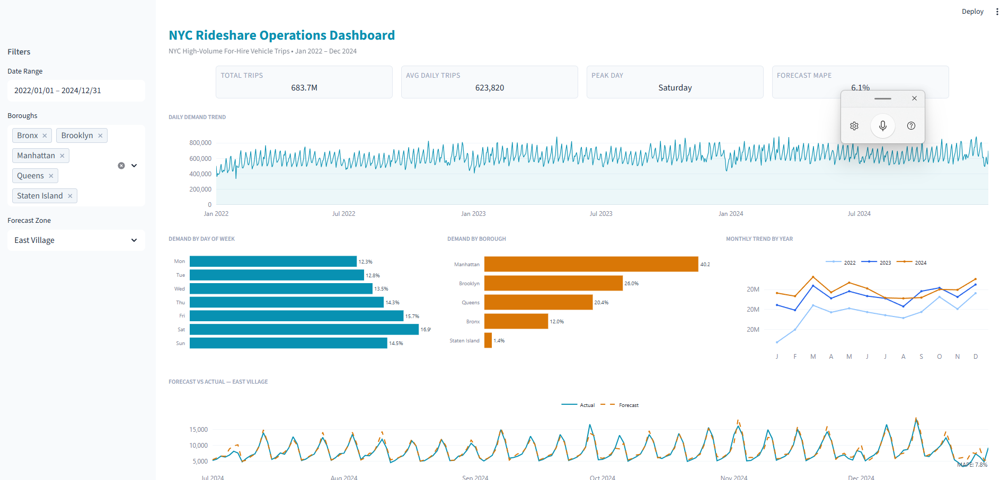
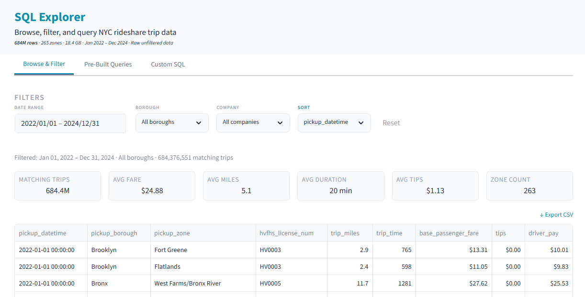

# NYC Rideshare Demand Forecasting

## Project Overview

This project forecasts daily rideshare volume across 195 NYC zones using 684 million trip records. Three models were evaluated, including a Seasonal Naive Baseline, Prophet and XGBoost. XGBoost was the best performer, achieving a 6.4% average MAPE with 97% of zones meeting the 10% error target.

---

## Scope

- **Forecast horizon:** This analysis focuses on short-term, one-day-ahead forecasting with the goal to provide an initial benchmark and to validate the data and modeling approach
- **Zone selection:** Zones with highly correlated demand patterns were selected so a single model could be applied (195 zones were modeled, 82% of total trip volume)

---

## Approach

The analysis follows a four-stage notebook pipeline.

1. **Data Download** — Download and consolidate monthly trip files into a single Parquet dataset
2. **Data Validation** — Validate trip records against thresholds for duration, distance, and fare
3. **Exploratory Analysis** — Examine demand patterns for seasonality, trend, and cross-zone correlation
4. **Demand Forecasting** — Evaluate three models, select the best performer, scale model across selected zones

The project also includes two interactive Streamlit applications for visualizing results and exploring the full dataset (see [Interactive Apps](#interactive-apps)).

---

## Results

Model performance was evaluated using mean absolute percentage error (MAPE) for one-day-ahead forecasts.

### Model Performance

- **XGBoost achieved an average 6.4% MAPE across the zones selected for modeling**
- 97% of zones met the <10% MAPE performance target
- Seasonal Naive model provided a good initial baseline
- Prophet appeared too complex for the short-term horizon forecast

### Demand Patterns

- Day-of-week patterns provided the strongest demand signal
- Weekend demand was generally higher than weekdays
- A majority of zones were highly correlated with global demand, allowing for use of a shared modeling approach

---

## Interactive Apps

The project includes two Streamlit apps: a dashboard for visualizing forecast results and an SQL browser to assist with data exploration.

### Operations Dashboard

An interactive dashboard showing KPIs, demand charts, and zone-level forecast accuracy.



- **KPI Summary** — Total trips, average daily demand, peak day, and median forecast MAPE
- **Demand Charts** — Daily trend, day-of-week and borough distributions, and year-over-year monthly comparison
- **Forecast vs Actual** — Zone-level comparison of predicted vs actual demand for a selected zone with MAPE displayed

Run locally:

    streamlit run app/dashboard.py

### SQL Explorer

An interactive SQL-powered tool for querying all 684 million trip records directly from Parquet via DuckDB.



- **Browse & Filter** — Explore raw trip records with date, borough, zone, company, and day-of-week filters
- **Pre-Built Queries** — 16 analytical queries covering window functions, CTEs, JOINs, and date/time analysis — each with a "View SQL" expander showing the exact query
- **Custom SQL** — Write and run your own SQL against the full dataset (with a row limit safeguard)
- **Architecture** — Modular five-file design separating entry point, tab rendering, query definitions, shared utilities, and styling

Run locally:

    streamlit run app/sql_explorer.py

> **Prerequisite:** The raw trip data (~18 GB) must be downloaded first by running `notebooks/00_data_download.ipynb`.

---

## Limitations

- Forecast horizon was limited to one-day-ahead predictions
- External variables that may affect demand (weather, events, policy changes) were not included
- Low-correlation zones (airports, entertainment districts) were not included in modeling

---

## Next Steps

- Incorporate time-series cross-validation (rolling/expanding window)
- Extend forecasting horizon to 7–14 days
- Re-evaluate Prophet at longer horizons where its decomposition approach may be better suited
- Add residual diagnostics (Ljung-Box test, ACF/PACF validation, segmented analysis by borough)
- Apply SHAP analysis for zone-level feature interpretation
- Evaluate additional models (LightGBM, ARIMA/SARIMAX)
- Add statistical significance testing (Diebold-Mariano, bootstrap CIs)
- Explore hyperparameter optimization
- Build additional models for outlier zones that show different demand patterns
- Integrate external demand drivers (weather, events)

These enhancements were identified through an AI-assisted review of the analysis. The full write-up and roadmap are in [`docs/`](docs/).

---

## Data

- **Source:** NYC Taxi & Limousine Commission
- **Dataset:** For-Hire Vehicle High Volume (FHVHV) trip records
- **Period:** January 2022 – December 2024
- **Scale:** 684 million trip records
- **Scope:** 195 high-correlation zones (82% of total demand)

---

## Tech Stack

- DuckDB 
- pandas, NumPy
- XGBoost
- Prophet
- scikit-learn
- Matplotlib
- Streamlit, Plotly

---

## Repository Structure

```
├── data/
│   ├── raw/                 # Original TLC trip files
│   ├── validated/           # Flagged and validated records
│   ├── processed/           # Consolidated parquet dataset
│   ├── quality_reports/     # Validation summary reports
│   └── results/             # Forecast outputs and model results
├── notebooks/               # Four-stage analysis pipeline
├── app/                     # Streamlit dashboards (operations dashboard + SQL explorer)
├── docs/                    # Enhancement roadmap and extended report
├── images/                  # README visual assets
└── requirements.txt         # Pinned dependencies
```

---

## Reproducibility & Validation

- Python 3.x environment with pinned dependencies (see `requirements.txt`)
- Random seeds fixed for all stochastic model training steps
- Raw data downloaded and consolidated programmatically
- Data validation and preprocessing executed entirely via code (no manual edits)
- One-day-ahead forecasting evaluated using temporal holdout validation
- Transformations applied after appropriate temporal separation to prevent leakage
- Notebook executes fully from top to bottom without hidden state
- Streamlit apps built from saved model outputs and raw Parquet data

## References

- NYC Taxi & Limousine Commission. (n.d.). TLC Trip Record Data. https://www.nyc.gov/site/tlc/about/tlc-trip-record-data.page

**K Flowers**
GitHub: [KRFlowers](https://github.com/KRFlowers)